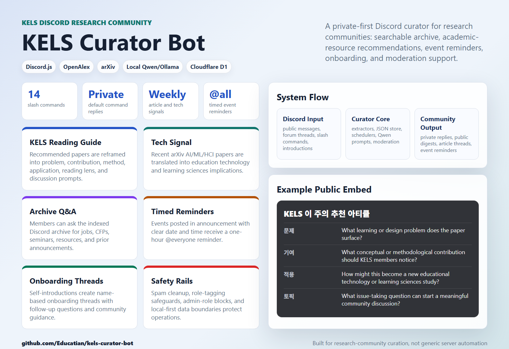
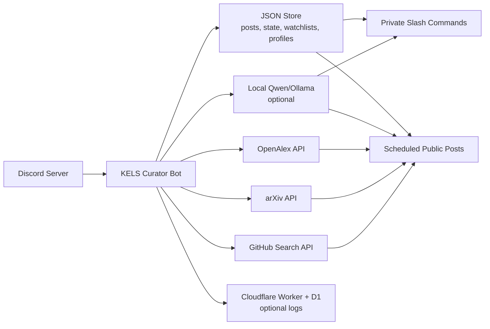

# KELS Curator Bot

<p align="center">
  
</p>



KELS Curator Bot is a Discord community curator for Korean edtech and learning sciences researchers. It indexes useful public channel posts, supports private slash-command search and digests, posts research-resource recommendations, assists onboarding, and helps moderators keep the server clean.

The bot is designed for the Korean Edutech/Learning Sciences Researcher Network workflow, but the architecture is reusable for other research communities that need lightweight curation, archive Q&A, event reminders, and academic-resource discovery.

## Core Features

- **Private slash commands** for `/digest`, `/search`, `/deadlines`, `/ask-kels`, `/watch`, `/profile`, `/cfp-helper`, `/topic-digest`, and `/field-map`.
- **Public weekly article recommendation** from OpenAlex, limited to JLS, IJCSCL, ETR&D, Instructional Science, and Cognition and Instruction.
- **KELS reading guide** for recommended articles, including problem, contribution, method, KELS research application, reading lens, issue-taking topic, discussion questions, and a participation prompt.
- **KELS Tech Signal** that compares recent arXiv tech papers and high-signal GitHub repositories, then posts one item with fixed sections for why now, educational technology use, learning sciences use, discussion, and a participation prompt.
- **FieldExplorer 1.0 bridge** that positions a topic, abstract, CFP, or project idea against the latest `Educatian/fieldexplorer1.0` venue/category map, links to the public app, and connects results back to related KELS archive originals.
- **Announcement event automation** that detects date/time/timezone plus Zoom, RSVP, and Google Form links; posts D-1 and one-hour `@everyone` reminders; and opens follow-up threads after events end.
- **Monthly Knowledge Flow** that summarizes community pulse, emerging topics, cross-channel knowledge bridges, evidence posts, and participation nudges.
- **Automatic community reactions** that add the KELS custom emoji and a like emoji to indexed member posts and thread replies.
- **Personal watchlists and profiles** for keyword and interest-topic DM alerts, plus recent related KELS originals that connect the member’s interests to the archive.
- **KELS Archive Q&A** powered by local Qwen/Ollama when enabled, with source links, channel/date evidence, relevance scores, related originals, and weak-evidence warnings.
- **Personalized onboarding pathway** that extracts the real full name, interests, affiliation/stage, and what the member is looking for, then creates a `Full Name 님` thread with related originals, participation targets, first-comment drafts, and a one-week follow-up.
- **Role-tagging assistance** with confidence thresholds, moderator review for ambiguous matches, and hard blocks for admin and communication-officer roles.
- **Spam cleanup** for obvious invite floods, free-Nitro scams, excessive URLs, excessive mentions, and repeated-message bursts.
- **Optional Cloudflare Worker/D1 logging** for bot interaction logs.

## Architecture At A Glance



More detail is in [docs/ARCHITECTURE.md](docs/ARCHITECTURE.md).

## Repository Layout

```text
src/
  index.js        Discord client, event handlers, schedulers
  commands.js     Slash command definitions
  config.js       Environment configuration
  connections.js  Interest-to-archive connection suggestions
  storage.js      JSON-backed local data store
  extractors.js   URL/date/time/category/tag extraction
  format.js       Discord embed and message formatting
  qwen.js         Local Qwen/Ollama prompts and fallbacks
  openalex.js     OpenAlex article recommendation source
  arxiv.js        arXiv Tech Signal source
  github-repos.js GitHub repository Tech Signal source
  knowledge-flow.js Monthly topic flow and participation analysis
  field-explorer.js Field-map topic loading and positioning
  relevance.js    Archive relevance and evidence ranking
  moderation.js   Spam detection
  logger.js       Local and optional Cloudflare logging
  onboarding-pathway.js Personalized onboarding intervention logic

scripts/          Setup, diagnostics, one-shot posting, role utilities
docs/             Feature guide and architecture documentation
cloudflare/       Optional Worker/D1 logging service
test/             Vitest unit tests
```

## Setup

1. Create a Discord application and bot in the Discord Developer Portal.
2. Enable Message Content Intent if you want automatic message indexing.
3. Invite the bot with:
   - Scopes: `bot`, `applications.commands`
   - Permissions: read messages, send messages, create public threads, send in threads, manage messages, add reactions, use slash commands
4. Copy `.env.example` to `.env` and fill in the required values:
   - `DISCORD_TOKEN`
   - `DISCORD_CLIENT_ID`
   - `DISCORD_GUILD_ID`
5. Install dependencies and register slash commands:

```powershell
npm.cmd install
npm.cmd run register
npm.cmd start
```

## Common Commands

```powershell
npm.cmd run doctor
npm.cmd run setup:check
npm.cmd run channels:list
npm.cmd run channels:verify
npm.cmd run knowledge-flow:demo
npm.cmd run article:demo
npm.cmd run tech-signal:demo
```

Manual public test posts:

```powershell
npm.cmd run article:post
npm.cmd run tech-signal:post
```

Windows background operation:

```powershell
powershell.exe -NoProfile -ExecutionPolicy Bypass -File .\scripts\start-bot.ps1
powershell.exe -NoProfile -ExecutionPolicy Bypass -File .\scripts\status-bot.ps1
powershell.exe -NoProfile -ExecutionPolicy Bypass -File .\scripts\stop-bot.ps1
```

## Environment Groups

The main configuration groups are:

- `DISCORD_*`: bot identity and target guild.
- `INDEX_CHANNELS`: public channels/forums to archive.
- `AUTO_REACT_*`: automatic KELS and like reactions for indexed member posts and thread replies.
- `ARTICLE_DIGEST_*`: weekly OpenAlex article recommendation.
- `TECH_SIGNAL_*`: weekly arXiv-vs-GitHub tech signal.
- `FIELD_EXPLORER_*`: optional `/field-map` integration with the latest FieldExplorer 1.0 `src/data/venues.json`, older embedded `index.tsx` network data, `Name,Type,Category` CSV exports, or BERTopic topic CSV files.
- `MONTHLY_RADAR_*`: monthly public Knowledge Flow summary.
- `DEADLINE_REMINDER_*`: D-14/D-7/D-2 deadline reminders.
- `EVENT_REMINDER_*`: `@everyone` one-hour reminders, D-1 reminders, event links, and follow-up threads for timed announcement events.
- `QWEN_*`: local Ollama/Qwen enhancement.
- `ROLE_*`: role-tagging behavior and safeguards.
- `ONBOARDING_*`: self-introduction pathway automation and one-week follow-up.
- `SPAM_*`: automatic spam deletion thresholds.
- `KELS_LOG_*`: optional Cloudflare logging endpoint.

Never commit `.env`, local `data/`, `logs/`, bot PID files, or Cloudflare `.dev.vars`.

## Privacy And Safety

- Slash command replies are private by default.
- Public posts are limited to configured automated curation and reminder workflows.
- The bot indexes only configured public channels/forums.
- Admin, moderator, and communication-officer style roles are blocked from automatic creation or assignment.
- Cloudflare logging is optional and should be configured only after the community understands what is logged.

## Validation

```powershell
npm.cmd run lint
npm.cmd test
npm.cmd run doctor
npm.cmd audit --json
```

Current test suite: Vitest unit tests for extractors, storage, commands, OpenAlex, arXiv, Qwen helpers, moderation, and configuration.
