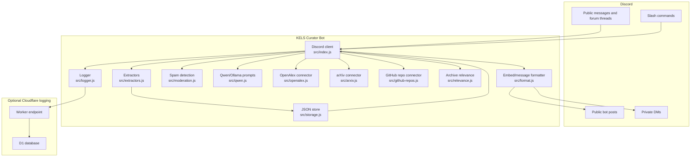
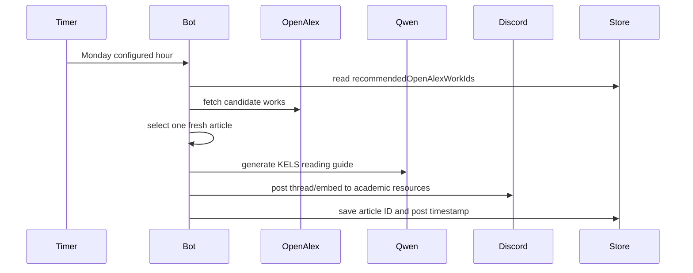
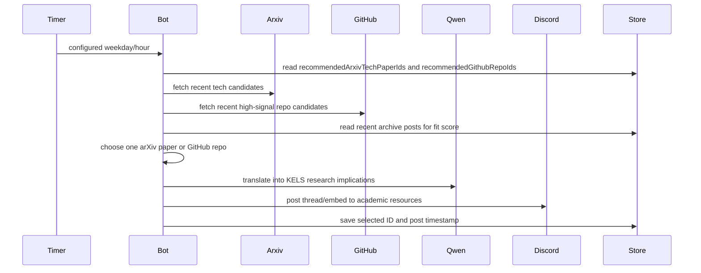
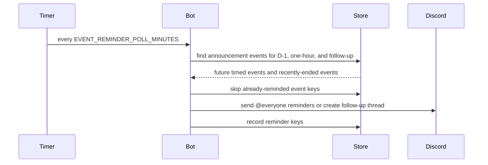
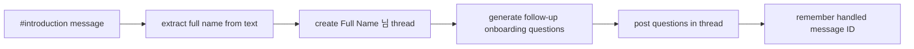

# KELS Curator Bot Architecture

This document explains how KELS Curator Bot is structured, how data moves through the system, and where each feature lives in the codebase.

## System Overview

KELS Curator Bot is a Node.js Discord bot built with `discord.js`. It runs as a long-lived process, listens to public Discord events, indexes selected messages into a local JSON store, and exposes both private slash commands and scheduled public community posts.



## Runtime Entry Point

`src/index.js` is the runtime hub.

It configures the Discord client, registers event listeners, and starts all schedulers:

- `MessageCreate`: spam deletion, message indexing, onboarding, watch/profile notifications, forum suggestions, role inference.
- `InteractionCreate`: slash command routing.
- `ClientReady`: scheduled jobs are started.
- `SIGINT`/`SIGTERM`: graceful shutdown.

The file intentionally keeps orchestration in one place, while most domain logic is delegated to modules.

## Core Modules

### `src/config.js`

Loads and validates environment variables. It groups configuration into:

- Discord identity and guild settings.
- channel indexing settings.
- scheduled post settings.
- Qwen/Ollama settings.
- onboarding, spam, role-tagging, and logging settings.
- GitHub Tech Signal, D-1 event reminders, event follow-up, and role-confidence thresholds.

Invalid numeric settings fail fast at startup.

### `src/commands.js`

Builds slash command payloads. The bot currently supports 14 commands:

- `/digest`
- `/search`
- `/watch`
- `/profile`
- `/ask-kels`
- `/cfp-helper`
- `/topic-digest`
- `/submit-cfp`
- `/backfill`
- `/stats`
- `/health`
- `/post-digest`
- `/deadlines`
- `/help-kels`

Command registration is handled by `scripts/register-commands.js`.

### `src/extractors.js`

Turns raw Discord message text into structured metadata:

- URLs
- date labels
- deadline dates
- timed event starts
- event links grouped as Zoom, RSVP, Google Form, and other links
- categories
- lightweight research tags

Timed event extraction is used for D-1 reminders, one-hour `@everyone` reminders, and post-event follow-up threads. It only acts on events that include both a date and a time.

### `src/storage.js`

Provides a JSON-backed store under `data/`.

Main records:

- `posts.json`: indexed public posts.
- `watchlists.json`: exact keyword alerts.
- `profiles.json`: user interest topics.
- `state.json`: scheduler state, sent reminders, previously recommended article IDs.
- `chatbot-logs.json`: optional local interaction logs.

The store keeps the last 5,000 indexed posts and preserves scheduler state so the bot does not repeatedly post the same automated item. It also exposes D-1 event lookup and recently-ended event lookup for announcement automation.

### `src/format.js`

Builds Discord embeds and text output.

This module owns:

- digest embeds
- search embeds
- deadline embeds
- article recommendation embeds
- KELS Tech Signal embeds
- event reminder embeds
- help, stats, and health text

The weekly article format now uses a deep `KELS reading guide` structure rather than a surface-level three-line summary.

### `src/qwen.js`

Wraps local Ollama calls and all Qwen prompts.

Qwen is optional. If `QWEN_ENABLED=false` or Ollama is unavailable, the bot falls back to rule-based or compact text.

Qwen-enhanced tasks:

- recommended article reading guide
- arXiv and GitHub Tech Signal digest
- forum title/tag suggestions
- profile-match explanations
- archive Q&A with source evidence, relevance, and weak-evidence handling
- CFP helper summaries
- topic digests
- onboarding questions
- onboarding profile extraction
- introduction name extraction
- role inference

### `src/openalex.js`

Fetches candidate article records from OpenAlex and selects one weekly recommendation from the KELS journal pool:

- Journal of the Learning Sciences
- International Journal of Computer-Supported Collaborative Learning
- Educational Technology Research and Development
- Instructional Science
- Cognition and Instruction

Selection currently favors freshness, open access, and citation count, while avoiding previously recommended work IDs.

### `src/arxiv.js`

Fetches recent arXiv AI/ML/HCI tech-paper candidates for `KELS Tech Signal`.

The default query targets:

- `cs.AI`
- `cs.CL`
- `cs.LG`
- `cs.HC`
- `stat.ML`

Candidate scoring favors relevant signals such as LLMs, RAG, agents, multimodal systems, evaluation, alignment, tutoring, feedback, and human-AI interaction.

### `src/github-repos.js`

Fetches GitHub repository candidates for `KELS Tech Signal`.

Default query lanes include LLM education, RAG education, AI agents, learning analytics, multimodal learning, and AI tutors. Scoring favors repository freshness, stars, forks, topical matches, and KELS archive fit.

### `src/relevance.js`

Ranks archive evidence for `/ask-kels` and public curation.

It infers simple filters from user queries, scores indexed posts by token overlap, appends related originals, and gives Tech Signal candidates a lightweight archive-fit bonus based on recent server interests.

### `src/moderation.js`

Detects obvious spam patterns:

- free-Nitro scams
- invite floods
- excessive links
- excessive mentions
- repeated messages
- repeated-character floods

When enabled, matching messages are deleted before indexing.

### `src/logger.js`

Saves interaction logs locally and optionally forwards them to the Cloudflare Worker.

The logger records event type, guild/channel/user metadata, command name, query excerpt, response excerpt, and structured metadata.

## Scheduled Workflows

### Weekly OpenAlex Article



### Weekly KELS Tech Signal



### Announcement Event Reminder



Important behavior:

- Events without time information are ignored.
- Events that already started are ignored.
- Each event reminder is sent once.
- `allowedMentions` explicitly permits `@everyone` for this workflow.
- Post-event follow-up threads ask members to share recordings, slides, links, or notes.

## Slash Command Privacy

Most slash commands respond with `ephemeral: true`. This means the response is visible only to the user who ran the command.

Public behavior is limited to:

- `/post-digest`, when a moderator explicitly posts to a channel.
- scheduled article recommendations.
- scheduled KELS Tech Signal posts.
- scheduled deadline and event reminders.
- onboarding threads created from public introductions.

## Role-Tagging Safety

Role inference uses Qwen only when enabled. It prefers existing roles and respects confidence thresholds.

Hard-blocked role families:

- Admin
- Administrator
- Admin & Facilitator
- CommunicationOfficer
- communication-management style roles

The bot may be unable to assign roles above its own highest role, which is expected Discord behavior.

## Onboarding Flow



The bot uses the self-introduction text, not the Discord display name, to infer the full name.

## Optional Cloudflare Logging

The optional logging service is located at:

```text
cloudflare/kels-bot-logs/
```

It exposes:

- `GET /health`
- `POST /logs`
- `GET /logs/recent`

The Worker requires a bearer token via `LOG_TOKEN`. Do not commit Worker secrets or `.dev.vars`.

## Operational Scripts

Key scripts:

- `scripts/register-commands.js`: register slash commands.
- `scripts/doctor.js`: validate env, Discord auth, guild access, channels, and local store.
- `scripts/start-bot.ps1`: run bot in the background on Windows.
- `scripts/status-bot.ps1`: inspect PID and recent logs.
- `scripts/stop-bot.ps1`: stop background bot process.
- `scripts/post-article-recommendation-now.js`: manually post one weekly article.
- `scripts/post-tech-signal-now.js`: manually post one Tech Signal.
- `scripts/edit-article-recommendation-thread.js`: edit a previously posted recommendation thread.
- `scripts/apply-roleless-fallback-role.js`: assign fallback onboarding role to roleless members.

## Data Boundaries

These files and directories must stay local:

- `.env`
- `.env.*` except `.env.example`
- `data/`
- `logs/`
- `kels-curator-bot.pid`
- `cloudflare/**/.dev.vars`
- `.wrangler/`

The repository should contain code, documentation, tests, and examples only.

## Validation Matrix

Run before deployment or pull requests:

```powershell
npm.cmd run lint
npm.cmd test
npm.cmd run doctor
npm.cmd audit --json
```

Expected coverage:

- extractors: URL/date/event parsing, classification, tags
- storage: posts, deadlines, event reminders, profiles, watchlists
- OpenAlex: article normalization and selection
- arXiv: XML parsing and Tech Signal selection
- Qwen helpers: JSON parsing and normalization
- moderation: spam detection
- commands/config: registration payload and environment validation
